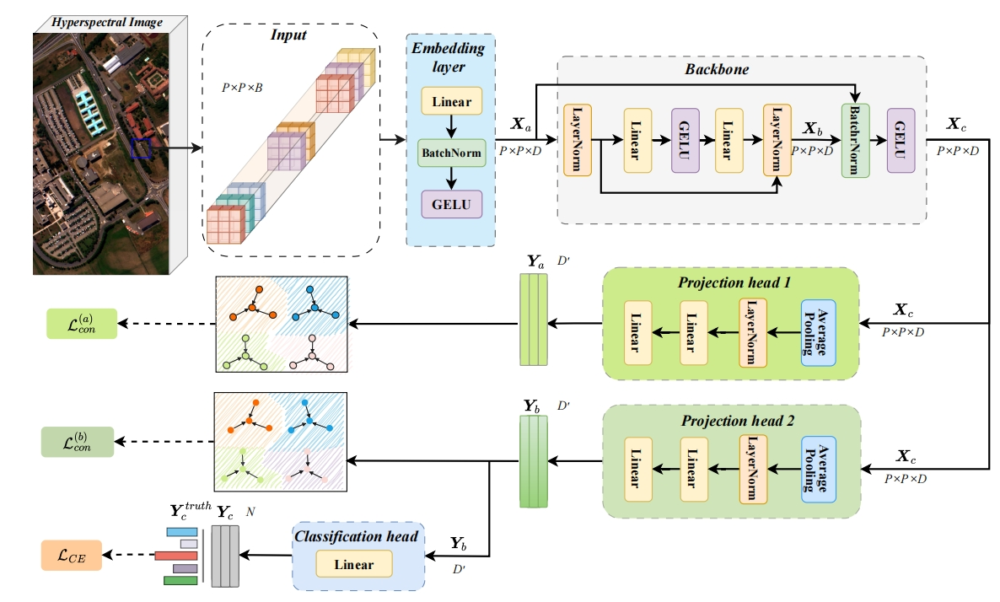
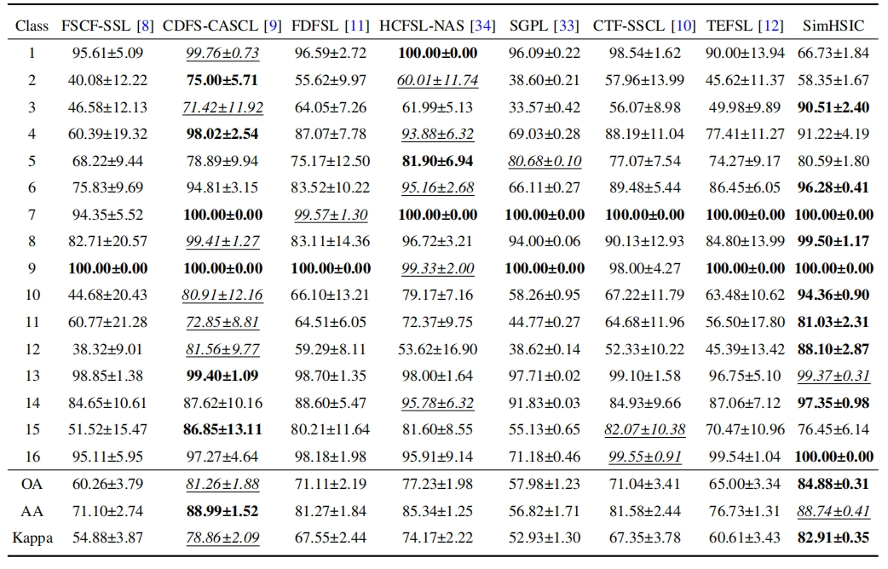

# Is Meta-learning Effective for Few-shot Hyperspectral Image Classification?


This is the origin Pytorch implementation of SLNet in the following paper: 
[Is Meta-learning Effective for Few-shot Hyperspectral Image Classification?] (Accepted by IEEE Transactions on Geoscience and Remote Sensing). 
## Model Architecture

<p align="center">

<br><br>
<b>Figure 1.</b> Overview of the proposed SimHSIC model. The architecture includes an embedding layer for spectral feature projection, a backbone for representation
learning, and a dual-branch head.
</p>


## Requirements
- python == 3.11.4
- numpy == 1.24.4
- pandas == 1.5.3
- scipy == 1.10.1
- torch == 2.1.0+cu118
- scikit-learn == 1.4.2
- matplotlib == 3.7.1
- loguru == 0.7.2


### Data Preparation
We follow [SpectralFormer](https://github.com/danfenghong/IEEE_TGRS_SpectralFormer) to prepare the four datasets. The preprocessed IP, UA and SA datasets are already put under the folder `./data`. The preprocessed HT dataset can be obtained in [here](https://mega.nz/file/zdgE2D6S#92HRT93gAKjTHFvKYqf0uuPsmtz6ZnLl6In706lyaqY).
After putting the downloaded HT dataset under the folder `./data`, you can obtain the folder tree as follows:
```
|-SimHSIC
| |-data
| | |-IndianPine.mat # IP dataset
| | |-Pavia.mat # UP dataset
| | |-Salinas.mat # SA dataset
| | |-Houston.mat # HT dataset
```


## Usage
Commands for training and testing SimHSIC of all datasets are in `./script/Main.sh`. 

More parameter information please refer to `main.py` and `run.py`.

We provide a complete command for training and testing SimHSIC:

```
python -u run.py --dataset <dataset> --epoches <epoches> --channel <channel> --patches <patches> --s_patches <s_patches> --aug_num <aug_num> \
                  --lambdaC <lambdaC> --sample_num <sample_num> --batch_size <batch_size> --learning_rate <learning_rate> --decay_num <decay_num>\
                  --d_model <d_model> --out_dims <out_dims> --dropout <dropout>
```

Here we provide a more detailed and complete command description for training and testing the model:

| Parameter name |                                          Description of parameter                                          |
|:--------------:|:----------------------------------------------------------------------------------------------------------:|
|      data      |                                              dataset to use                                              |
|  flag_test |                                       testing mark                               |
|   gpu_id   |                                            gpu id                                        |
| seed |                                       number of seed                                    |
|   batch_size  |                                          number of batch size                                           |
|    test_freq    |                                         number of evaluation                                    |
|     channel     |                                                 bandwidth                                               |
|    patches    |                                              number of patches                                            |
|    s_patches    |                                            number of s patches, which is as same as the number of patches                                            |
|    aug_num    |                                            number of augmentations                                        |
|   sample_num |                                K-shot                         |
| d_model | size of hidden dimension |
| out_dims | size of output dimension |
|    dropout     |                                                  Dropout rate                                                   |
|    epoches     |                                                epoch number                                                 |
|     learning_rate     |                                             learning rate                                            |
| gamma |                                     gamma                              |
|  decay_num  |                       decay_num                        |
| lambdaC |                                     lambda                                   |
| temperature | temperature |
| itr  |                                itration                                 |
| weight_decay | weight_decay |


## Results
The experiment parameters of each dataset are formated in the `./script/Main.sh`. You can refer to these parameters for experiments, and you can also adjust the parameters to obtain better results. We present the OA, AA and Kappa results of the four datasets in Figure 2~5.

<p align="center">

<br><br>
<b>Figure 2.</b> CLASSIFICATION PERFORMANCE (%) ON THE IP DATASET.
</p>

<p align="center">

<br><br>
<b>Figure 3.</b> Forecasting results without missing values.
</p>


## Contact
If you have any questions, feel free to contact Li Shen through Email (shenli@buaa.edu.cn) or Github issues. Pull requests are highly welcomed!
